# Night Fox 🦊

A Visual Studio Code theme based on the Mao Santaella's [Night Wolf theme](https://marketplace.visualstudio.com/items?itemName=MaoSantaella.night-wolf) (which was based on the Sarah Drasner's [Night owl theme](https://marketplace.visualstudio.com/items?itemName=sdras.night-owl)).

*This was based in my own personal taste.

## C
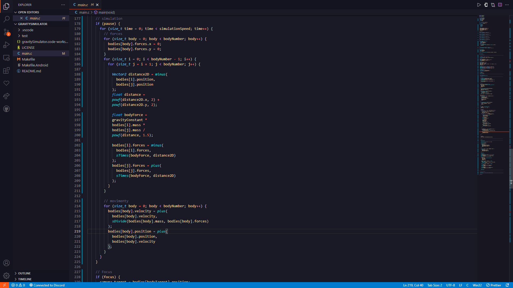
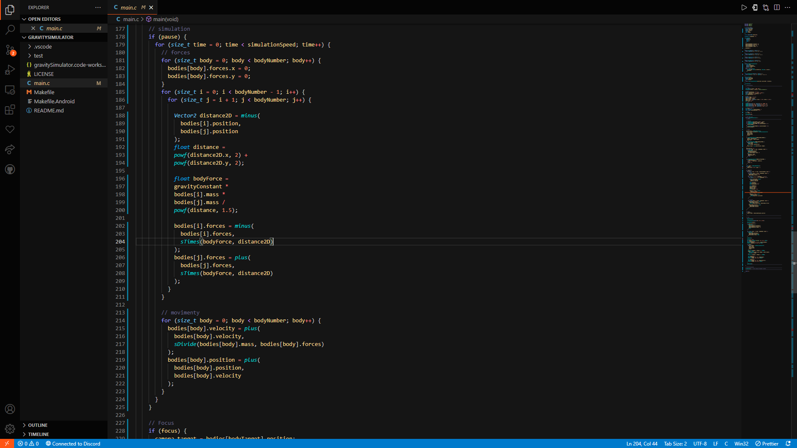

## Python
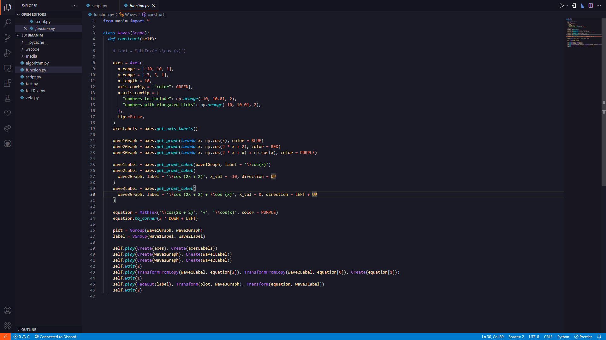
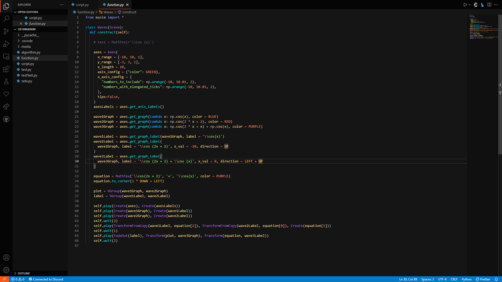

## C#
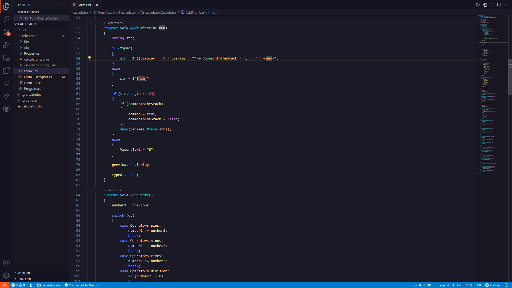
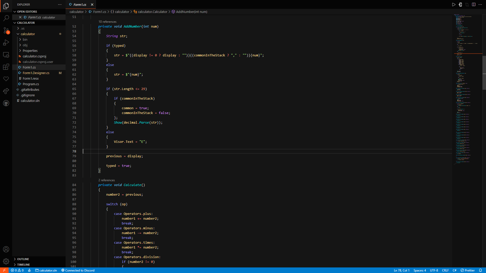

## JavaScript
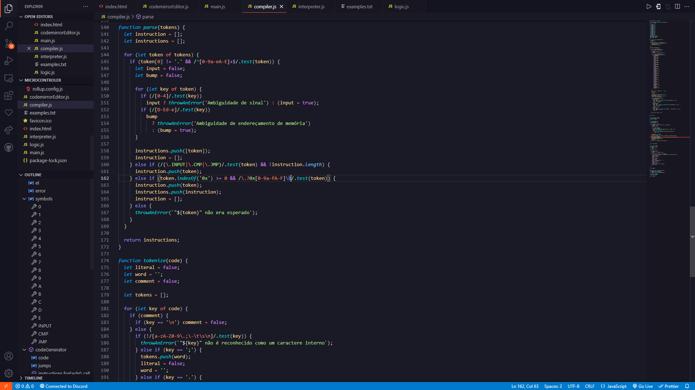
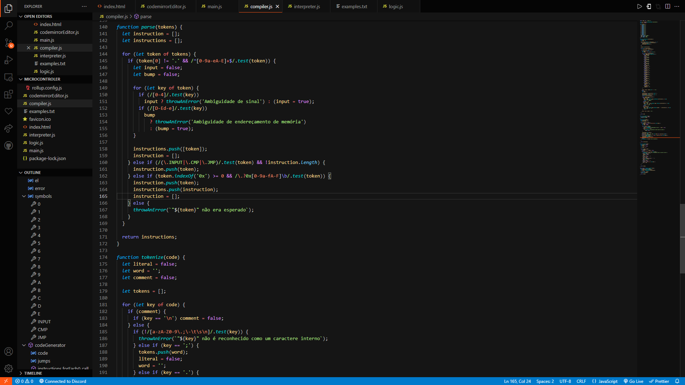

## Dart
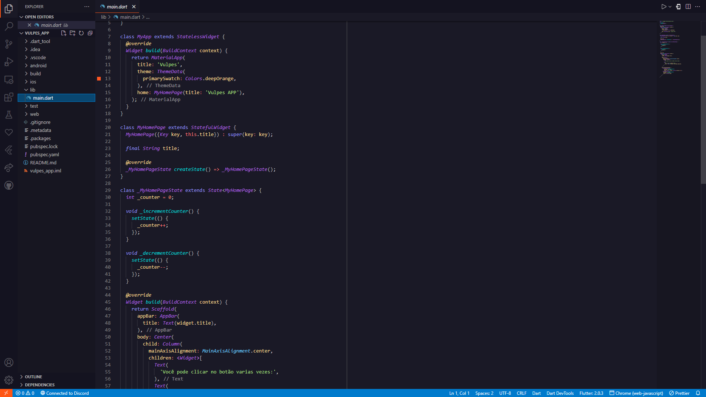
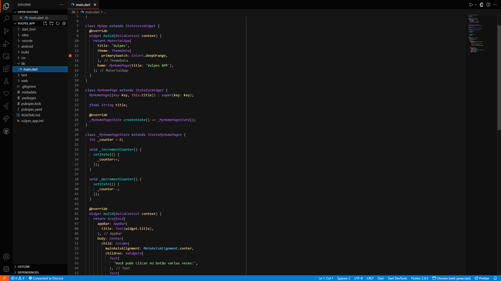

## HTML
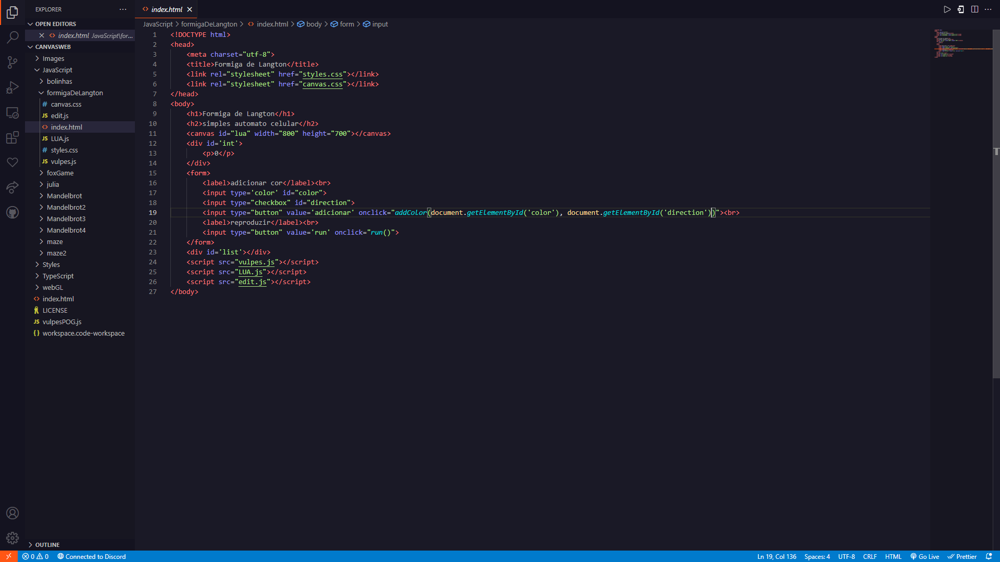
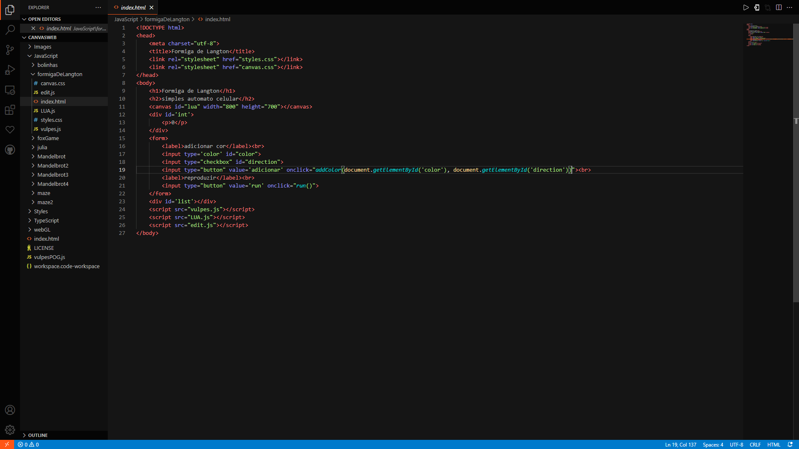

## Vue
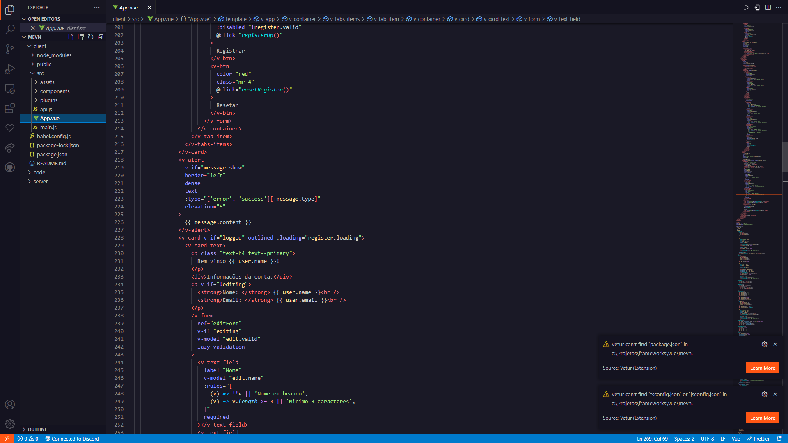
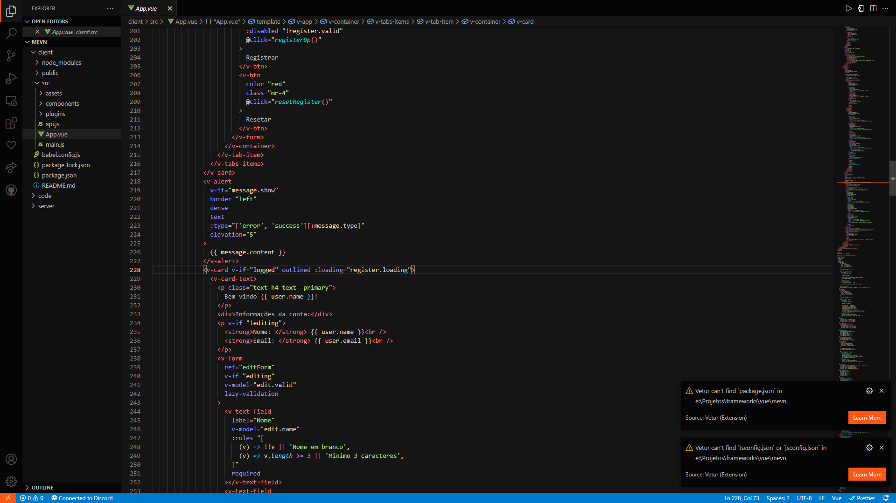

## JSON
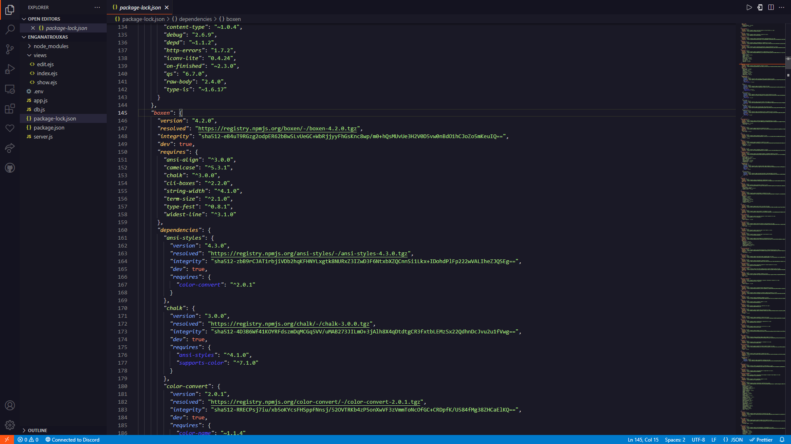
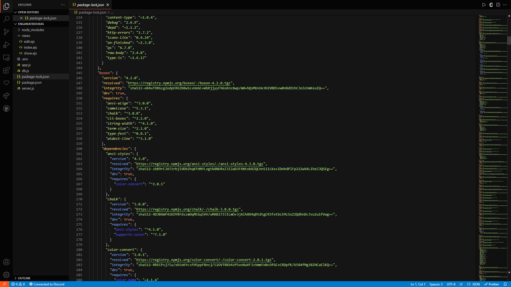

*big images to preserve details
<!---
# Installation (not works)

1.  Install [Visual Studio Code](https://code.visualstudio.com/)
2.  Launch Visual Studio Code
3.  Choose **Extensions** from menu
4.  Search for `night-fox`
5.  Click **Install** to install it
6.  Click **Reload** to reload VsCode
7.  From the menu bar click: Code > Preferences > Color Theme > **Night Fox**

# Misc

This is also my first foray into creating a theme, so if you see something amiss, please feel free to [file an issue](https://github.com/maoma87/NightWolfTheme/issues)! I'm sure there are things I missed.

Any relevant changes for each version are documented in the changelog. Please update and check the changelog before filing any issues, as they may have already been taken care of.--->
